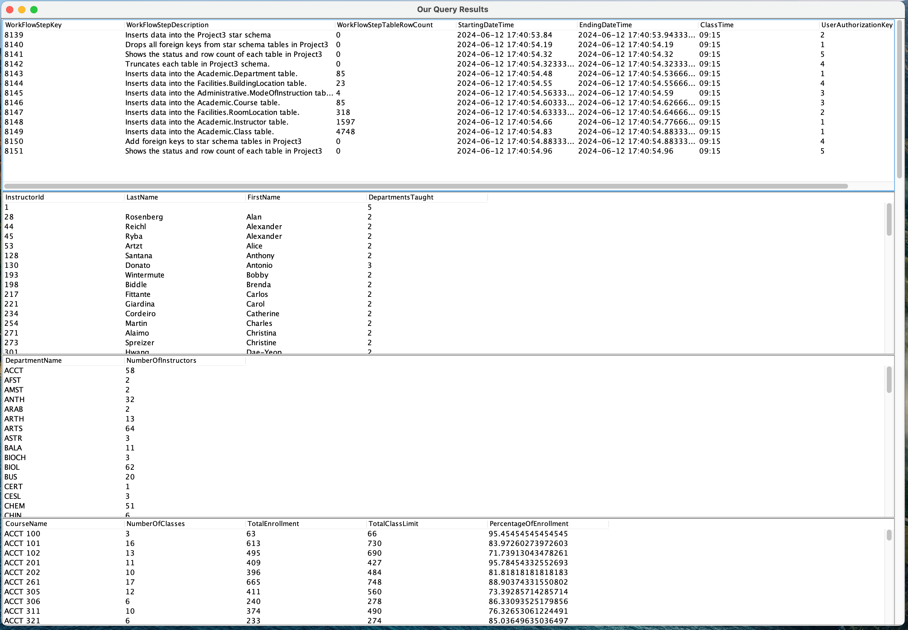

# QueensClassScheduleCurrentSemester Project

This project demonstrates the integration of Microsoft SQL Server and Java using JDBC (Java Database Connectivity). It allows you to connect to a database, execute SQL queries, and retrieve data using Java code.

## How our Java JTable looks when run:


## Overview
This project integrates SQL and Java to manage and visualize academic scheduling data. It involves designing a database, implementing SQL procedures, and developing a Java application to execute these procedures and display the results using Java Swing's `JTable`.

## Project Description
- **Database Design and Management**: Collaboratively designed the `QueensClassScheduleCurrentSemester` database, converting it into an Entity-Relationship Diagram (ERD). Implemented SQL procedures to manage database integrity, streamline setup, and maintain data consistency using Docker and Azure Data Studio.


- **Advanced SQL Querying**: Engineered SQL queries in Jupyter Notebooks with four peers, using advanced techniques like subqueries and Common Table Expressions (CTEs) to enhance data analysis and efficiently examine academic scheduling data.


- **Java Application Development**: Developed a Java application using JDBC to execute SQL procedures on Microsoft SQL Server. Integrated the application with Java Swing's `JTable` for displaying query results, enhancing cross-platform data management, visualization, and operational efficiency.

## Features
- **SQL Procedure Execution**: Execute stored SQL procedures to load and manage academic scheduling data.
- **Data Visualization**: Display query results in a user-friendly table format using `JTable`.
- **Dynamic Query Handling**: Iterate through multiple SQL queries and dynamically generate tables for each result set.

## File Structure
- `DatabaseConfig.java`: Contains database configuration details.
- `DatabaseManager.java`: Manages the database connection and query execution.
- `CreateTable.java`: Handles the creation of `JTable` from `ResultSet`.
- `Main.java`: The main class that orchestrates the application workflow.

## Setup and Usage
### Prerequisites
- Java Development Kit (JDK) 11 or later
- Microsoft SQL Server
- SQL Server JDBC Driver
- Docker 
- Azure Data Studio 

### Step-by-Step Guide
1. **Clone the Repository**
```
   git clone <repository-url>
   cd <repository-directory>
```